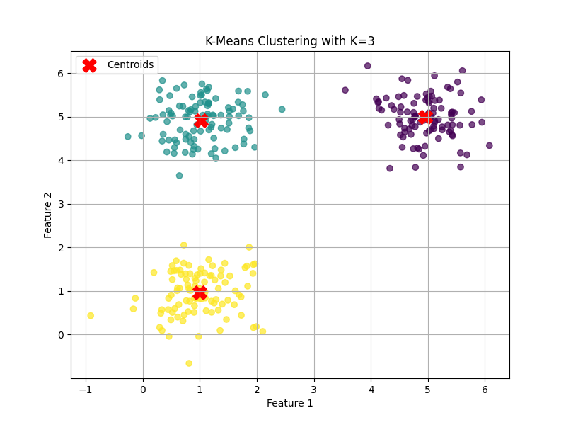

# E15 K-Means Interactive Application

## Project Overview

This project implements an interactive K-Means clustering application. It allows users to dynamically generate 2D data, adjust parameters for data groups, configure the K-Means algorithm, and visualize the clustering results in real-time. The application is built upon the foundational concepts explored in the E11 project, with a focus on extensive UI enhancements for interactive exploration.

## Features

-   **Interactive Data Generation:** Generate 2D data for three distinct groups (A, B, C) with configurable means and standard deviations.
-   **Dynamic K-Means Clustering:** Apply the K-Means algorithm with a user-definable number of clusters (K).
-   **Real-time Visualization:** Visualize the generated data, K-Means cluster regions (Voronoi-style), and cluster centroids.
-   **Sample Size Control:** Adjust the percentage of data points displayed in the visualization without affecting the K-Means computation, which always runs on the full dataset.
-   **Group Parameter Adjustment:** Interactively modify the mean and standard deviation of individual data groups.
-   **Performance Metrics:** Display K-Means computation time and classification accuracy.

## Screenshots

Below is an example output from the application.

**K-Means Clustering Plot:**



## Understanding K-Means Decision Boundaries

An interesting observation in K-Means clustering is that the decision boundaries between clusters are always straight lines (or flat hyperplanes in higher dimensions). This is a fundamental characteristic of the algorithm.

**Why are the boundaries straight?**

K-Means assigns each data point to the cluster whose centroid is closest. The boundary between any two clusters (say, Cluster 1 and Cluster 2) is formed by all points that are equidistant from the centroid of Cluster 1 and the centroid of Cluster 2. In Euclidean space, the locus of points equidistant from two fixed points is the perpendicular bisector of the line segment connecting those two points. This perpendicular bisector is always a straight line.

When you have more than two clusters, the decision regions (called Voronoi cells) are formed by the intersection of multiple such straight-line boundaries, resulting in convex polygonal regions.

**What about curved boundaries?**

If your data naturally forms clusters with curved or non-linear boundaries, standard K-Means may not perform optimally. To find such clusters, other algorithms are more suitable, such as:

*   **DBSCAN (Density-Based Spatial Clustering of Applications with Noise):** Can discover clusters of arbitrary shape based on data point density.
*   **Spectral Clustering:** Uses graph theory to partition data points, often effective for non-convex clusters.
*   **Kernel K-Means:** A variant of K-Means that uses the "kernel trick" to implicitly map data into a higher-dimensional space, allowing it to find non-linear boundaries in the original feature space.

## Installation

To set up and run the project, follow these steps:

1.  **Clone the repository:**
    ```bash
    git clone <repository_url>
    cd E15_kMean
    ```

2.  **Install `uv` (if you don't have it):**
    ```bash
    pip install uv
    ```

3.  **Install dependencies:**
    ```bash
    uv pip install numpy scikit-learn matplotlib
    ```

## Usage

To run the interactive application:

```bash
python ui_app.py
```

Once the application window appears, you can:

-   Use the **"Sample Size (%)" slider** to adjust the number of data points shown.
-   Select a **Group (A, B, C)** using the radio buttons.
-   Adjust the **mean** of the selected group using the arrow buttons (↑↓←→).
-   Adjust the **standard deviation** of the selected group using the **"Std Dev" slider**.
-   Click **"Regenerate Data"** to apply changes to group parameters and generate new data.
-   Use the **"K Value" slider** to set the number of clusters for K-Means.
-   Click **"Compute K-Means"** to re-run the clustering algorithm with the current data and K-value.

## Project Structure

```
E15_kMean/
├── main.py                 # Main entry point (currently placeholder)
├── data_generator.py       # Module for generating synthetic 2D data
├── kmeans_model.py         # Module for K-Means clustering logic
├── ui_app.py               # Main application for the interactive UI
├── pyproject.toml          # Project metadata and dependencies
├── uv.lock                 # uv lock file for dependencies
├── REQUIREMENTS.md         # Detailed functional and non-functional requirements
├── GEMINI.md               # Context and overview for AI assistant
├── DECISIONS.md            # Documented architectural and implementation decisions
├── TODO.md                 # List of remaining tasks and future enhancements
├── CHAT.md                 # Summary of AI-assisted development conversation
├── COSTS.md                # Placeholder for token usage and cost tracking
└── kmeans_clustering_plot.png # Example output of kmeans_model.py
```

## Documentation

-   **`REQUIREMENTS.md`**: Detailed specification of functional and non-functional requirements.
-   **`GEMINI.md`**: Contextual information and overview for AI-assisted development.
-   **`DECISIONS.md`**: Records key architectural and implementation decisions.
-   **`TODO.md`**: Lists outstanding tasks, potential improvements, and future work.
-   **`CHAT.md`**: Summarizes the development conversation and progress.
-   **`COSTS.md`**: Placeholder for tracking token usage and associated costs.
